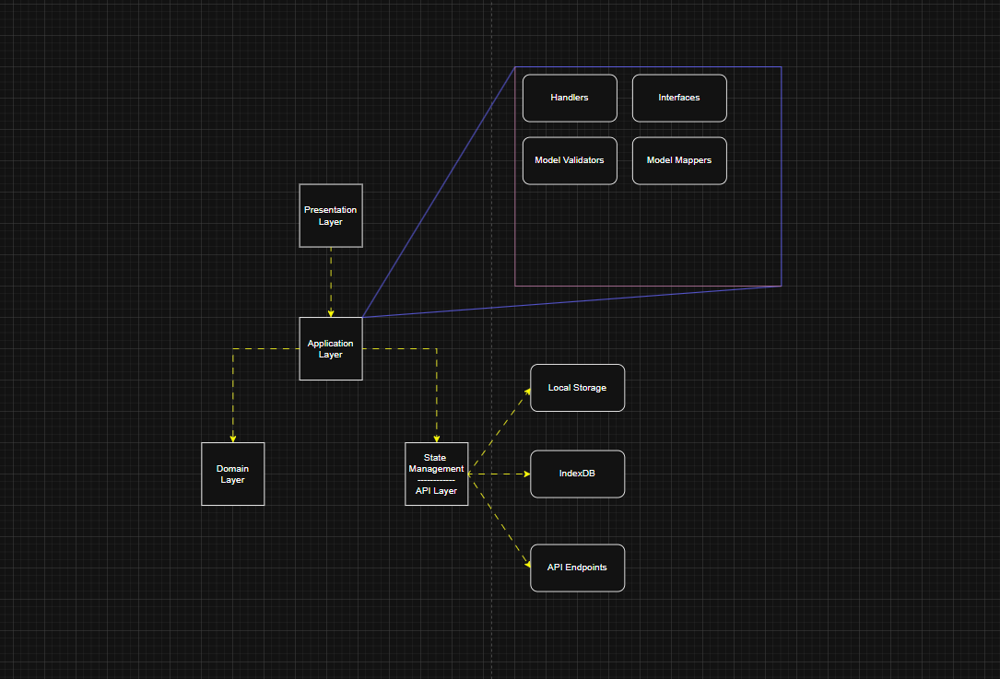

[Architecture](#architecture)
- [Architecture](#architecture)
  - [🖼️ Presentation Layer](#️-presentation-layer)
  - [💽 API Layer / State Management (Infrastructure Layer)](#-api-layer--state-management-infrastructure-layer)
  - [🏢 Application Layer](#-application-layer)
  - [🧬 Domain Layer](#-domain-layer)
    - [Architecture Overview](#architecture-overview)
- [Authentication vs Authorization](#authentication-vs-authorization)
      - [🪪  `Authentication`](#--authentication)
      - [🚓 `Authorization`](#-authorization)
  - [Problem](#problem)
    - [`Solution`](#solution)
    - [`Interactive Proof`](#interactive-proof)
  - [`How to implement this:`](#how-to-implement-this)
  - [🔐 Zero-Knowledge Password Login Protocol](#-zero-knowledge-password-login-protocol)
    - [Login Flow](#login-flow)
    - [🎯 Key Concepts](#-key-concepts)
  - [📝 Zero-Knowledge Password Registration Protocol](#-zero-knowledge-password-registration-protocol)
    - [Registration Flow](#registration-flow)
    - [🔐 Why This Is Secure](#-why-this-is-secure)

# Architecture

## 🖼️ Presentation Layer
- Render Response ViewModels

## 💽 API Layer / State Management (Infrastructure Layer)
- Caching
- Local Storage
- IndexDB
- Data Fetching

## 🏢 Application Layer
- Logic Handlers
- Model Mappers
- Model Validators

## 🧬 Domain Layer
- Entities
- Value Objects

### Architecture Overview

# Authentication vs Authorization

#### 🪪  `Authentication`
> Authenticatiton is the process of determining if you are, who you say you are. 

#### 🚓 `Authorization`
> Authorization is the process of determinintig what resources an Authenticated Client has permission to access.

## Problem
**`How to verify the Client without the Client giving up any sensitive information.`**

### `Solution`
- My Password: $x$
- Public Generator: $g$
- Prompted to enter password
- Compute the value $Y$ $$Y = g^x$$
- Hash and send the value $Y$ to the server.

### `Interactive Proof`
- Client pick a random number $r$
- The System will compute a value $A = g^r$
- Send the value $A$ to the server
- The Server sends a random number to the client  $c$
- The Client computes a response $z$ where $\dots$ $$z = r + c \times x$$
- Then the server verifies that $$g^z == A \times Y^c$$
- This expands to $\dots$ $$ g^{r + cx} == g^r \times (g^x)^c == g^r \times g^{xc} $$

Since $g^a \times g^b$ == $g^{a + b}$ and $ \mathbb{R} $ is a Abelian Group over multiplication  it follows that $ g^{r + cx} == g^r \times g^{xc} $

## `How to implement this:`

## 🔐 Zero-Knowledge Password Login Protocol

### Login Flow

1. **User clicks the Login Button**.

2. **Client sends a login initiation request to the server**.

3. **Server responds with:**

   * Public generator $g$
   * Prime modulus $p$
   * User-specific commitment $Y = g^x \mod p$ — previously registered

4. **User enters their password**.

5. **Client hashes the password** to derive the secret $x$.

6. **Client picks a random number** $r$, and computes:

   $$
   A = g^r \mod p
   $$

7. **Client sends** $A$ **to the server**.

8. **Server responds with a challenge** $c$, a random number.

9. **Client computes the response**:

   $$
   z = r + c \cdot x \mod (p - 1)
   $$

10. **Client sends** $z$ **to the server**.

11. **Server verifies** the proof by checking:

    $$
    g^z \equiv A \cdot Y^c \mod p
    $$

12. **If the equation holds**, the server logs the user in.

---

### 🎯 Key Concepts

* Only **one password entry** is needed.
* The server **never sees the password** or the secret $x$.
* The commitment $Y$ is **stored securely during registration** and reused during login.
* The **mathematical relationship must remain intact** — avoid hashing inside exponentiation operations.

---

## 📝 Zero-Knowledge Password Registration Protocol

### Registration Flow

1. **User chooses a password** (e.g., `"correct horse battery staple"`).

2. **Client hashes the password** to derive the secret number $x$:

   $$
   x = \text{Hash}(\text{password})
   $$

   *(e.g., using SHA-256 and interpreting it as an integer)*

3. **Client receives or agrees on system-wide public parameters**:

   * Generator $g$
   * Prime modulus $p$

4. **Client computes the public commitment**:

   $$
   Y = g^x \mod p
   $$

5. **Client sends** $Y$ **to the server**, along with the user's ID (e.g., username or email).

6. **Server stores**:

   * User ID
   * Public commitment $Y$

   ⚠️ **The server never stores or learns the password or the secret** $x$.

---

### 🔐 Why This Is Secure

* $Y$ is a one-way commitment to the password — the server cannot retrieve $x$ (or the password) from it.
* During login, the user proves they know $x$ **without ever revealing it**.
* Even if the server is breached, the attacker cannot reverse $Y = g^x \mod p$ to recover the password (unless quantum computers become practical).

